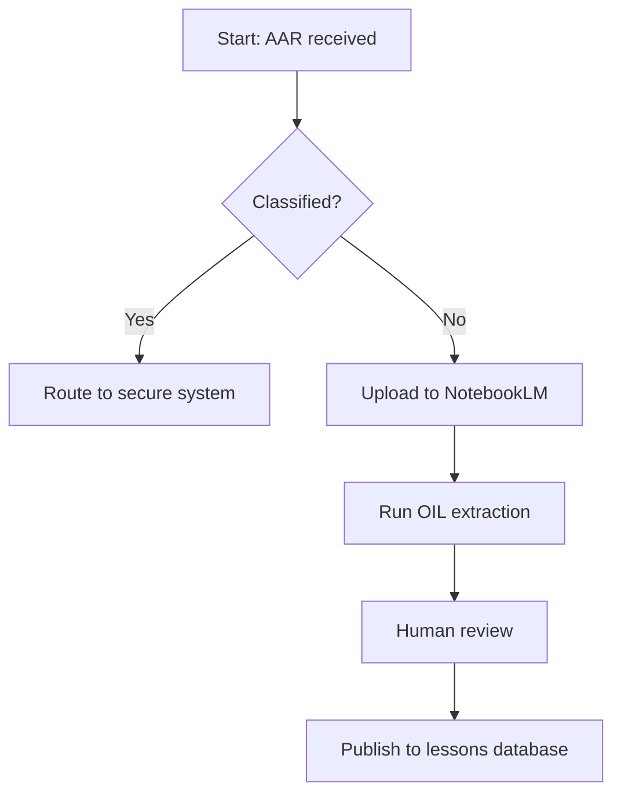
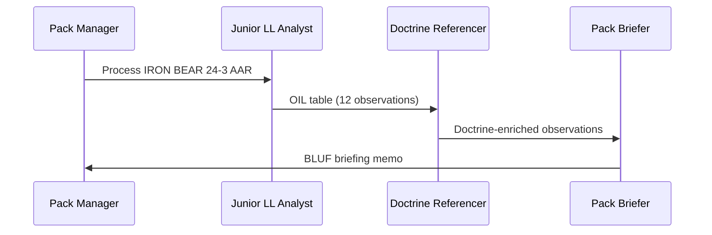
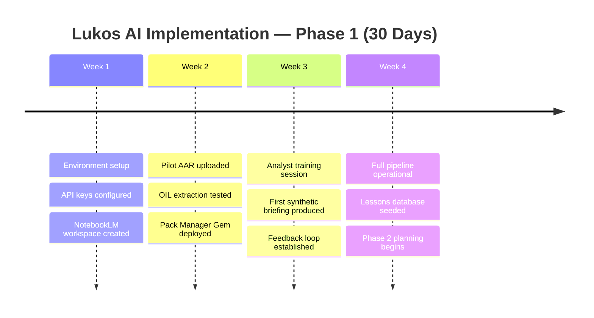
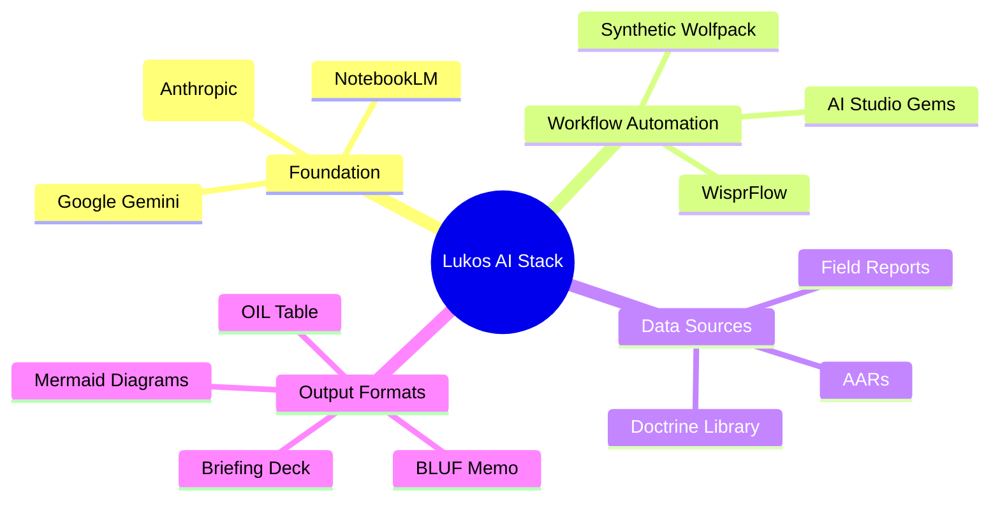
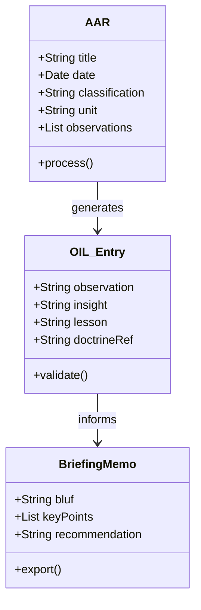
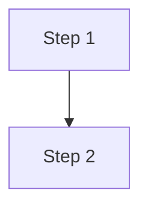

# Addendum C: Mermaid.js — Visual Thinking for Analysts

```{image} ../images/add-c-mermaid-workflow.png
:alt: The Mermaid.js AI workflow — Describe, Generate, Preview, Iterate
:width: 100%
```

Every good analyst briefing needs a diagram. A well-placed flowchart communicates a six-step process faster than three paragraphs of prose. A sequence diagram makes a multi-agent AI workflow immediately legible to a room full of senior leaders who have never touched a terminal.

The problem has always been time. Building a professional-looking diagram in PowerPoint or Visio can consume twenty minutes of your morning — adjusting boxes, nudging arrows, fixing fonts. By the time it looks right, your thinking has moved on.

**Mermaid.js solves this.** Write text. Get a diagram. The whole loop — including AI generation — takes thirty seconds.

This addendum is your field reference for Mermaid.js. You'll learn what it is, why it belongs in every Lukos analyst's toolkit, and how to produce any diagram type with a single prompt to Gemini or Claude.

---

## What Is Mermaid.js?

Mermaid.js is a markdown-based diagramming language. Instead of drawing shapes, you write structured text — and the tool renders it as a clean, professional diagram automatically.

A simple flowchart in Mermaid looks like this:

```
flowchart TD
    A[Start] --> B{Decision?}
    B -->|Yes| C[Action A]
    B -->|No| D[Action B]
```

That fifteen-word snippet produces a formatted decision tree. No drag-and-drop. No alignment headaches.

### Where Mermaid Renders Natively

Mermaid is not a standalone app — it's a rendering engine baked into platforms you already use:

| Platform | Support |
|---|---|
| **GitHub** | Renders in README files, issues, and wikis |
| **GitLab** | Native rendering in markdown |
| **Notion** | Paste as a code block, select "Mermaid" |
| **Obsidian** | Built-in with the Mermaid plugin |
| **VS Code** | Mermaid Preview extension |
| **MyST Markdown / Jupyter Book** | Native — used throughout *The Wolfpack's Edge* |
| **mermaid.live** | Free online renderer; paste and preview instantly |

Every diagram in this book was rendered by Jupyter Book's native Mermaid support. When you push your own chapters or analysis reports using the same stack, your diagrams render automatically.

---

## Why Analysts Should Care

```{image} ../images/add-c-diagram-types.png
:alt: The five Mermaid diagram types — flowchart, sequence, timeline, mind map, decision tree
:width: 100%
```

The Lukos Wolfpack operates in a high-tempo environment. Briefings need to be clear, concise, and scannable. AI-generated outputs, SOPs, and multi-agent workflows are inherently complex — and complexity demands visualization.

Here is where each diagram type fits into Lukos analyst work:

| Diagram Type | Lukos Use Case |
|---|---|
| **Flowchart** | SOPs, AAR processing pipelines, decision logic |
| **Sequence Diagram** | Multi-agent workflows, human-AI handoff protocols |
| **Timeline** | Project tracking, 30/60/90-day implementation plans |
| **Mind Map** | AI stack overviews, concept mapping, brainstorming |
| **Class/Entity Diagram** | Data models, system architecture |

The decisive advantage: Gemini and Claude can generate valid Mermaid syntax from a plain-English description. You describe the process you're already thinking about; the AI writes the diagram code; you preview and iterate. No diagramming expertise required.

---

## The Four-Step Workflow

**Step 1 — Describe**
Tell the AI what you want in plain English. Be specific about the type of diagram, the number of nodes, and the flow direction.

**Step 2 — Generate**
The AI returns Mermaid syntax inside a code block. Copy it.

**Step 3 — Preview**
Paste the code into [mermaid.live](https://mermaid.live) or your target platform. Confirm it renders correctly.

**Step 4 — Iterate**
If something is off — labels too long, flow direction wrong, a missing branch — tell the AI exactly what to fix. One follow-up prompt usually resolves it.

The entire cycle takes under two minutes on the first attempt and thirty seconds for revisions.

---

## The Prompt Template

Use this template every time. It produces clean, usable Mermaid code on the first try:

> *"Create a Mermaid [flowchart / sequence / timeline / mindmap] showing [describe what you want in plain English]. Use clear, short labels — five words or fewer per node. Keep it to [N] nodes maximum. Use [top-down / left-right] layout."*

**Example prompt:**

> *"Create a Mermaid flowchart showing the AAR processing pipeline at Lukos — from receiving an After Action Review to publishing it in the lessons database. Include a decision branch for classified documents. Use top-down layout and keep labels short."*

**AI output:** (paste directly into your tool)



---

## Diagram Types with Working Examples

### Flowchart — The Workhorse

Flowcharts are the most versatile diagram type. Use them for any process that has steps, decisions, or branches. For Lukos analysts, flowcharts are the go-to format for SOPs, intake pipelines, and decision logic.

**Key syntax elements:**

- `TD` = top-down layout; `LR` = left-right
- `[Box]` = rectangle (process step)
- `{Diamond}` = decision node
- `-->|Label|` = labeled arrow

**Example — AAR Intake Pipeline:**


---

### Sequence Diagram — For Multi-Agent Workflows

Sequence diagrams show how multiple actors communicate over time. They are ideal for documenting multi-agent AI workflows, where tasks pass between a Pack Manager, analyst agents, and human reviewers.

**Key syntax elements:**

- `participant X as Label` = define an actor
- `X->>Y: message` = solid arrow (request or action)
- `Y-->>X: message` = dashed arrow (response)

**Example — Synthetic Wolfpack Processing an AAR:**



This diagram makes the hand-off chain legible at a glance. In a briefing, it answers "who does what and in what order" without requiring the audience to read a paragraph of explanation.

---

### Timeline — For Project Tracking

Timelines communicate implementation phases and milestones. Use them in briefings when presenting a 30/60/90-day AI rollout plan or a phased capability introduction.

**Example — 30-Day AI Implementation Plan:**



---

### Mind Map — For Concept Visualization

Mind maps are ideal for presenting the architecture of a system or the relationships between concepts. Use them when introducing the Lukos AI stack to a new team member or briefing leadership on your capability set.

**Example — The Lukos AI Stack:**



---

### Class Diagram — For System Architecture

Class diagrams document the structure of a system — its components and how they relate. Use them when designing or explaining the data model behind your lessons database or knowledge management system.

**Example — Lessons Database Structure:**



---

## Where to Use Mermaid Diagrams

```{image} ../images/add-c-where-to-use.png
:alt: The Mermaid ecosystem — mermaid.live, GitHub, Notion, Obsidian, MyST Markdown
:width: 100%
```

### mermaid.live — Start Here

[mermaid.live](https://mermaid.live) is the fastest way to preview any diagram. Paste your code in the left panel; the diagram renders on the right. Export as PNG or SVG when you need a standalone image for a PowerPoint or report.

Bookmark this. You'll use it every time you generate a diagram with AI before committing it to a final document.

### GitHub README Files

GitHub renders Mermaid natively in any markdown file. When you document a Lukos AI workflow in a repository README, your flowcharts and sequence diagrams appear as professional visuals — no images to upload, no external links.

Wrap your Mermaid code in a fenced code block with the `mermaid` tag:

````

````

### Notion

Notion supports Mermaid inside code blocks. Create a code block, select "Mermaid" as the language, and paste your syntax. The diagram renders inline within your Notion page — ideal for internal SOPs, project wikis, and team briefings.

### Obsidian

Obsidian renders Mermaid natively with the core Mermaid plugin. For analysts who use Obsidian as their personal knowledge management system, this means every note can include a live diagram. Link a mind map of the Lukos AI stack to your onboarding vault; it renders every time someone opens the note.

### VS Code

The Mermaid Preview extension (by Bierner) renders diagrams directly in the VS Code editor. If you write your analysis or SOPs in VS Code, you can preview diagrams without leaving the application.

### MyST Markdown / Jupyter Book

*The Wolfpack's Edge* is built on MyST Markdown and Jupyter Book. Mermaid diagrams are natively supported — every code block tagged `mermaid` renders as a diagram when the book is built and deployed. This is why every diagram in this book is written in Mermaid rather than embedded as an image: the source is readable as text, versionable in git, and renders perfectly across devices.

---

## Quick-Reference Syntax Card

| Diagram Type | Opening Line | Use For |
|---|---|---|
| Flowchart (top-down) | `flowchart TD` | Processes, SOPs, pipelines |
| Flowchart (left-right) | `flowchart LR` | Timelines, horizontal flows |
| Sequence | `sequenceDiagram` | Multi-agent, human-AI handoff |
| Timeline | `timeline` | Project phases, milestones |
| Mind Map | `mindmap` | Architecture, concept maps |
| Class Diagram | `classDiagram` | Data models, system design |

**Decision nodes:** `{Text}` — use inside flowcharts for yes/no branches.

**Labeled arrows:** `-->|Label|` — add text to any arrow.

**Subgraphs:** Group related nodes visually inside a flowchart:

```
subgraph "AI Layer"
    G[Gemini] --> N[NotebookLM]
end
```

---

## Common Mistakes and Fixes

**Problem:** The diagram doesn't render; shows a parse error.
**Fix:** Ask the AI: *"The Mermaid code returned a parse error. Review the syntax and fix any issues without changing the content."*

**Problem:** Node labels are too long and overlap.
**Fix:** Add to your prompt: *"Keep all node labels to five words or fewer."*

**Problem:** The flow direction feels backwards.
**Fix:** Change `TD` (top-down) to `LR` (left-right) or `BT` (bottom-top).

**Problem:** Too many nodes — the diagram is cluttered.
**Fix:** Ask the AI to *"collapse the [section] into a single summary node and add a note that it can be expanded separately."*

---

## The One-Minute Drill

The next time you need a diagram for a briefing, run this drill:

1. Open a chat with Gemini or Claude.
2. Type: *"Create a Mermaid flowchart showing [your process]. Short labels. Top-down layout. Max 8 nodes."*
3. Copy the code block.
4. Paste into [mermaid.live](https://mermaid.live).
5. Screenshot or export PNG.

Total time: sixty seconds. Your briefing now has a professional diagram that would have taken twenty minutes in PowerPoint.

That is the Wolfpack's Edge — not working harder, but thinking faster.

---

*Mermaid.js documentation: [mermaid.js.org](https://mermaid.js.org)*
*Live renderer: [mermaid.live](https://mermaid.live)*
*AI prompt library for diagrams: See Appendix B — Gem Library*
