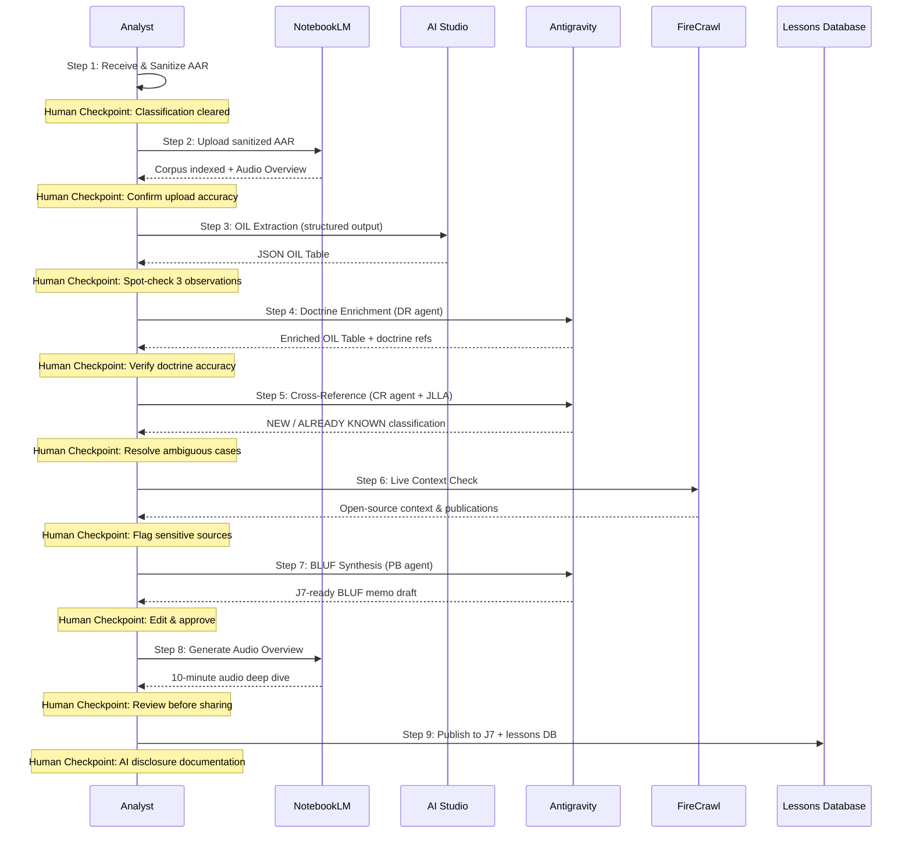

# Addendum D: The Value Creation Flow — From AAR to Insight

> *The analyst's job is judgment. Every hour spent on mechanical processing is an hour stolen from thinking.*

---

## The Problem

A Lukos analyst receives a raw After-Action Review. By the time it becomes a customer-deliverable insight product — cross-referenced against the existing lessons database, enriched with relevant doctrine, formatted to J7 standards, reviewed for classification, and published to the right stakeholders — it has passed through six to eight manual steps and consumed three to four hours of analyst time.

That is not a workflow problem. That is an architecture problem.

The tools in this book — NotebookLM, AI Studio, Antigravity, FireCrawl — do not replace the analyst. They restructure where the analyst's time goes. The AI stack converts mechanical steps into supervised steps. The analyst moves from execution to judgment.

With the full Lukos AI stack, that same AAR-to-insight flow produces a draft insight product in **under 30 minutes of active analyst time** — with higher consistency, documented sourcing, and a defensible audit trail.

This addendum maps the complete flow, step by step.

---

## The Complete Flow

```{figure} ../images/add-d-full-flow.png
:alt: The 9-step AAR-to-Insight pipeline showing inputs, tools, outputs, and human checkpoints
:width: 100%

**Figure D.1 — The Complete AAR-to-Insight Pipeline.** Each step shows the input, tool, output, and human checkpoint that keeps the analyst in command of the product.
```

Each step follows a consistent structure: **Input → Tool → Output → Human Checkpoint.**

---

### Step 1: Receive and Sanitize the AAR

| Field | Detail |
|-------|--------|
| **Input** | Raw AAR document (email, shared drive, or physical scan) |
| **Tool** | Analyst inbox + manual review |
| **Output** | Clean document — sanitized for classification and CUI markings |
| **Human Checkpoint** | Analyst confirms no classified material will be uploaded to cloud tools; CUI markings stripped or documented |

This step is manual by design. No AI tool should ever receive a document that has not been cleared for that tool's data handling environment. The analyst reviews the document, removes or redacts any classification markings or Controlled Unclassified Information (CUI) that would prohibit cloud upload, and confirms the sanitized version is cleared for the workflow ahead.

**What the analyst checks:** Classification level. CUI categories. Distribution markings. Whether any named individuals require removal before upload.

**Governance log:** Analyst records the original document identifier, sanitization actions taken, and clearance-for-upload decision in the AAR processing log. Retained for 90 days minimum.

---

### Step 2: Upload to NotebookLM

| Field | Detail |
|-------|--------|
| **Input** | Sanitized AAR document |
| **Tool** | NotebookLM |
| **Output** | Corpus indexed; Audio Overview generated |
| **Human Checkpoint** | Analyst confirms successful upload, reviews source list, listens to 2-minute Audio Overview summary |

The sanitized AAR is uploaded to the analyst's NotebookLM workspace. NotebookLM indexes the document and generates an Audio Overview — a conversational summary of the content. This is not the final product; it is an orientation layer. The analyst listens to the overview to confirm that the content was captured correctly and to identify any obvious gaps or distortions in the AI's initial read.

**What the analyst checks:** Accuracy of the Audio Overview summary. Correct identification of key events, actors, and outcomes. Any content the model appears to have missed or mischaracterized.

**Governance log:** Upload timestamp, document identifier, and confirmation of successful indexing logged to the AAR processing record.

---

### Step 3: Initial OIL Extraction

| Field | Detail |
|-------|--------|
| **Input** | Indexed AAR corpus in NotebookLM |
| **Tool** | AI Studio (Gemini 2.5 Pro, structured output mode) |
| **Output** | JSON OIL table (Observations, Issues, Lessons) |
| **Human Checkpoint** | Analyst spot-checks 3 randomly selected observations for accuracy and fidelity to source |

The analyst exports the AAR text and submits it to AI Studio using the OIL extraction prompt from the Gem Library (Appendix B). The model returns a structured JSON table with observations categorized by domain, issues identified, and candidate lessons extracted. Structured output mode ensures the response is machine-readable and consistent across runs.

**What the analyst checks:** Three randomly selected observations are traced back to the source document. The analyst confirms the model has not hallucinated events, inflated severity, or collapsed distinct observations into single entries.

**Governance log:** AI Studio model version, prompt used (by name and version), JSON output hash, analyst spot-check results. Retained with the insight product package.

---

### Step 4: Doctrine Enrichment

| Field | Detail |
|-------|--------|
| **Input** | JSON OIL table |
| **Tool** | Antigravity (DR agent + doctrine skill) |
| **Output** | Enriched OIL table with doctrine references |
| **Human Checkpoint** | Analyst verifies doctrine references are accurate, current, and applicable |

The raw OIL table is submitted to Antigravity's Doctrine Reference (DR) agent, which cross-references each observation and lesson against the relevant doctrine corpus. The agent returns an enriched table with specific FM, ATP, and joint publication references attached to each entry.

This step converts raw observations into doctrine-grounded findings — the difference between "the unit had communication problems" and "the unit's communication posture did not meet FM 6-02 requirements for echelon-above-brigade operations."

**What the analyst checks:** That each doctrine reference is accurate (correct FM number, correct paragraph), that the reference is still current (not superseded), and that the doctrine actually applies to the observed context.

**Governance log:** DR agent version, doctrine corpus version date, analyst verification results. Any corrections made by the analyst are documented with rationale.

---

### Step 5: Cross-Reference Against Existing Lessons

| Field | Detail |
|-------|--------|
| **Input** | Enriched OIL table |
| **Tool** | Antigravity (CR agent + JLLA skill) |
| **Output** | OIL table with NEW / ALREADY KNOWN classification |
| **Human Checkpoint** | Analyst resolves ambiguous classifications; confirms truly new lessons |

The enriched OIL table is submitted to Antigravity's Cross-Reference (CR) agent, which queries the JLLA (Joint Lessons Learned Application) database and the organization's internal lessons library. Each entry is classified as NEW (not previously documented) or ALREADY KNOWN (with citation to existing lesson record).

ALREADY KNOWN lessons are valuable — they confirm persistence of a known issue and strengthen the case for remediation. NEW lessons are priority items for the insight product.

**What the analyst checks:** Ambiguous classifications — cases where the CR agent is uncertain. The analyst reviews the referenced existing lesson and determines whether the new observation is genuinely new, a recurrence, or a variation. This is the highest-judgment step in the flow.

**Governance log:** CR agent version, database query timestamp, classification results, analyst resolution decisions for all ambiguous cases.

---

### Step 6: Live Context Check

| Field | Detail |
|-------|--------|
| **Input** | NEW lessons from the OIL table |
| **Tool** | FireCrawl (via Antigravity tool integration) |
| **Output** | Recent publications, partner-nation updates, open-source context |
| **Human Checkpoint** | Analyst flags sensitive external sources; confirms external context is appropriate for inclusion |

For lessons classified as NEW, the analyst triggers a live context check via FireCrawl. The tool searches recent open-source publications, partner-nation doctrine updates, and relevant professional journals for external confirmation or contradiction of the finding.

This step grounds the insight product in current context — preventing the team from publishing a "new" lesson that was addressed in a recent partner-nation publication, or missing an emerging trend in open-source reporting.

**What the analyst checks:** Whether any external sources are sensitive (FOUO, proprietary, or otherwise restricted). Whether external context supports, contradicts, or adds nuance to the finding. Whether external sources are appropriate for citation in a customer-deliverable product.

**Governance log:** FireCrawl query terms, sources returned, sources selected for inclusion, analyst sensitivity review decision. Retained with insight product.

---

### Step 7: BLUF Synthesis

| Field | Detail |
|-------|--------|
| **Input** | Enriched, cross-referenced OIL table + live context |
| **Tool** | Antigravity (PB agent — "Plain BLUF" persona) |
| **Output** | J7-ready BLUF briefing memo draft |
| **Human Checkpoint** | Analyst edits for accuracy, tone, and J7 formatting standards; approves final draft |

The complete enriched OIL table and live context are submitted to Antigravity's Plain BLUF (PB) agent. The agent produces a structured BLUF briefing memo formatted to J7 standards — executive summary, key observations, doctrine-grounded lessons, recommended actions, and an open-questions section.

This is the core customer deliverable. The AI draft is a starting point, not a finished product. The analyst edits, restructures, and approves.

**What the analyst checks:** Accuracy of all facts and citations. Appropriate tone for the customer relationship. Correct J7 formatting. That recommended actions are operationally realistic. That the BLUF actually leads with the most important finding.

**Governance log:** PB agent version, prompt version, draft timestamp, analyst edits summary (nature and extent), final approval signature.

---

### Step 8: Audio Overview

| Field | Detail |
|-------|--------|
| **Input** | Approved BLUF memo |
| **Tool** | NotebookLM |
| **Output** | 10-minute audio deep dive |
| **Human Checkpoint** | Analyst reviews audio before sharing with customer |

The approved BLUF memo is uploaded to NotebookLM, which generates a 10-minute Audio Overview — a conversational deep dive suitable for busy senior customers who may not read the full document. The audio is reviewed by the analyst before distribution.

**What the analyst checks:** That the audio accurately represents the written product. That no sensitive language or draft-stage phrasing appears in the recording. That tone is appropriate for the customer audience.

**Governance log:** Audio generation timestamp, analyst review confirmation, distribution authorization.

---

### Step 9: Publish

| Field | Detail |
|-------|--------|
| **Input** | Approved BLUF memo + audio overview |
| **Tool** | Google Drive (immediate) / Vertex AI (production pipeline) |
| **Output** | Distributed to J7 stakeholders and lessons database |
| **Human Checkpoint** | Analyst documents AI contribution per organizational AI use policy |

The final insight product — written memo and audio overview — is published to the customer distribution list and submitted to the lessons database for future cross-reference. The analyst completes an AI contribution disclosure, documenting which steps used AI assistance and the nature of analyst oversight at each step.

**What the analyst checks:** Correct distribution list. Database submission formatting. AI contribution documentation completeness.

**Governance log:** Distribution timestamp, recipient list, database submission confirmation, AI disclosure document. All records retained per organizational records management policy.

---

## The Time Comparison

```{figure} ../images/add-d-time-comparison.png
:alt: Time comparison chart showing manual 3-4 hours vs AI-assisted 25-35 minutes
:width: 100%

**Figure D.2 — Where the Time Goes.** The AI stack does not eliminate analyst time — it restructures it. Manual steps become supervised steps. Execution time becomes judgment time.
```

| Mode | Total Clock Time | Active Analyst Time | Time Spent On |
|------|-----------------|--------------------:|---------------|
| **Manual** | 3–4 hours | 3–4 hours | Execution of every step |
| **AI-Assisted** | 45–60 minutes | 25–35 minutes | Supervision, judgment, editing |

The AI stack does not make the analyst faster at the same job. It changes the job. The analyst who spent 90 minutes manually cross-referencing the JLLA database now spends 8 minutes reviewing the CR agent's output and resolving ambiguous cases. The analyst who spent 45 minutes drafting the BLUF now spends 15 minutes editing and approving the AI draft.

The time savings are real. The more important shift is qualitative: the analyst is no longer an executor. They are a reviewer, a judge, and a quality gate.

---

## The Mermaid Diagram



---

## The Offline Variant

```{figure} ../images/add-d-offline-variant.png
:alt: Offline workflow diagram showing which steps work disconnected and which are deferred
:width: 100%

**Figure D.3 — The Offline Variant.** Field-deployed analysts without cloud access can execute a degraded but disciplined version of the flow using LM Studio and Gemma 4. Core judgment steps are preserved; cloud-dependent steps are deferred.
```

For field-deployed analysts operating without cloud access, the full pipeline is not available. The offline variant preserves the discipline of the flow while working within connectivity constraints.

| Step | Online | Offline |
|------|--------|---------|
| 1. Receive & Sanitize | ✅ Manual | ✅ Manual (unchanged) |
| 2. Upload to NotebookLM | ✅ Cloud | ⏸ Deferred — no cloud |
| 3. OIL Extraction | ✅ AI Studio | ✅ LM Studio + Gemma 4 |
| 4. Doctrine Enrichment | ✅ Antigravity (DR) | ⏸ Manual reference lookup |
| 5. Cross-Reference | ✅ Antigravity (CR) | ⏸ Manual JLLA search |
| 6. Live Context Check | ✅ FireCrawl | ⏸ Deferred — no internet |
| 7. BLUF Synthesis | ✅ Antigravity (PB) | ✅ LM Studio + Gemma 4 |
| 8. Audio Overview | ✅ NotebookLM | ⏸ Deferred |
| 9. Publish | ✅ Drive/Vertex | ⏸ Deferred — distributed on reconnect |

**The offline analyst's output:** A draft OIL table (from LM Studio) and a rough BLUF memo (from LM Studio). Steps 4, 5, and 6 are performed manually at reduced fidelity. Steps 2, 8, and 9 are queued for execution when connectivity is restored.

**The key principle:** The structure of the flow is preserved even when the tools are degraded. The analyst still works through the same nine steps in the same order. The AI assistance at steps 3 and 7 is provided by a local model rather than a cloud model. Quality is lower. Consistency is lower. But the discipline — the habit of following the flow — is maintained.

When the analyst reconnects, they upload the offline artifacts and run steps 2, 4, 5, 6, 8, and 9 to complete and publish the insight product.

---

## The Governance Layer

Every step in this flow produces a log entry. The cumulative log is what makes the insight product defensible to a customer.

| Step | What Gets Logged | Where | Retention |
|------|-----------------|-------|-----------|
| 1 | Sanitization actions, clearance decision | AAR processing record | 90 days |
| 2 | Upload timestamp, source confirmation | Processing record | 90 days |
| 3 | Model version, prompt version, JSON hash, spot-check results | Insight product package | Duration of product life |
| 4 | DR agent version, doctrine corpus date, verification results, analyst corrections | Insight product package | Duration of product life |
| 5 | CR agent version, query timestamp, classification results, analyst resolutions | Insight product package | Duration of product life |
| 6 | Query terms, sources reviewed, sources selected, sensitivity decisions | Insight product package | Duration of product life |
| 7 | PB agent version, prompt version, draft timestamp, analyst edits summary, approval signature | Insight product package | Duration of product life |
| 8 | Audio generation timestamp, analyst review confirmation | Distribution record | 90 days |
| 9 | Distribution list, database submission, AI disclosure document | Permanent record | Per records management policy |

The governance log answers the customer's three questions:
1. **What did the AI do?** — logged at steps 3, 4, 5, 6, and 7
2. **What did the analyst verify?** — logged at every step's human checkpoint
3. **Can you reconstruct the reasoning?** — yes, because the JSON artifacts, prompt versions, and model versions are retained with the product

This is not bureaucracy. This is the difference between a product the customer can trust and a product they have to take on faith.

---

## Summary

The AAR-to-Insight flow is the operational unit of Lukos knowledge work. Every engagement, every exercise, every field observation that goes through this flow produces a traceable, doctrine-grounded, customer-ready insight product — in under 30 minutes of active analyst time.

The tools change. The flow does not. The analyst's role — judgment, verification, approval — does not change either. What changes is the ratio of execution to judgment. Less execution. More thinking.

That is the value creation story.

---

*Addendum D is a reference document. Refer to it when onboarding new analysts to the AI stack or when reviewing the workflow for quality assurance purposes.*
