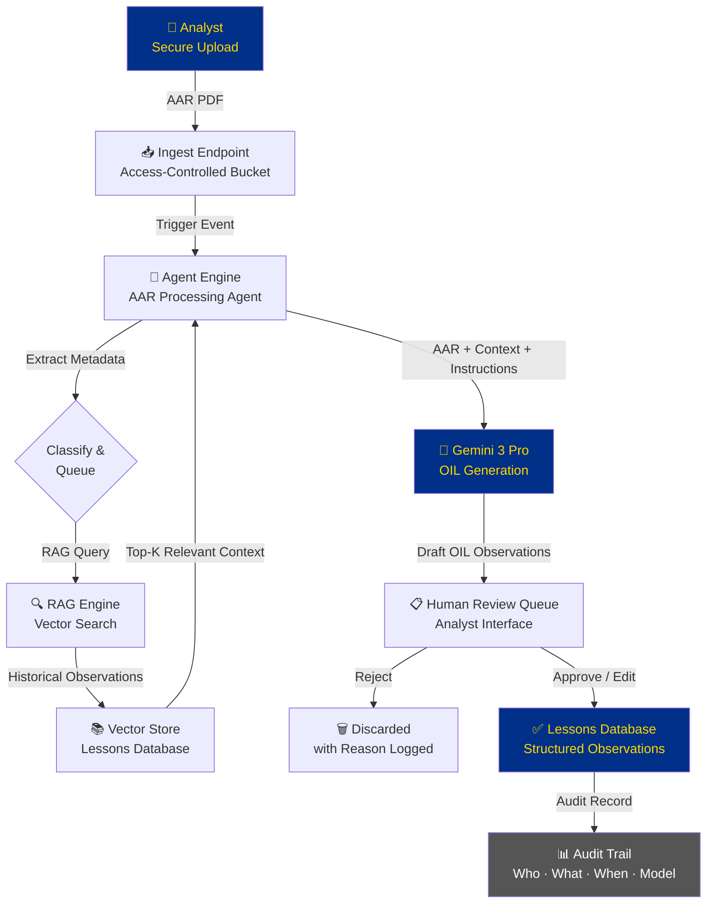

# Chapter 5: The Kennel

> *"In Special Operations, the working dog that lives in the kennel and the family pet that runs in the backyard are both dogs. But only one of them deploys."*

You've been living in the backyard.

Chapters 2, 3, and 4 took you through Gemini, AI Studio, and NotebookLM — powerful, accessible tools that live in Google's consumer ecosystem. You've used them to draft documents, build prompt workflows, and interrogate your own research files. You've seen what AI can do for an individual analyst, a site lead, or a program manager working unilateral on their own machine.

That work was real. Those skills transfer. Don't discount them.

But here's the question this chapter answers: **What happens when the backyard becomes a job site?**

What happens when the tool you built in AI Studio is so good that the customer wants to use it daily — and they're USSOCOM? What happens when you're processing FOUO data, and you need to prove — not claim, not imply, but *prove* — that the data never left an authorized environment? What happens when you need to answer the question "Who ran that query at 1400 on Tuesday, what did they submit, and what did the model return?"

That's when you need the Kennel.

---

## 5.1 What Vertex Is — And Why It Was Renamed

```{figure} ../images/ch05-vertex-overview.png
:alt: Vertex AI / Gemini Enterprise Agent Platform components overview
:width: 100%

**The Gemini Enterprise Agent Platform** — formerly Vertex AI. Every component your team needs to build, govern, and sustain production AI agents under federal-grade accountability.
```

Here's the history in thirty seconds, because it matters.

For years, Google Cloud's AI platform was called **Vertex AI**. It was a powerful but technical product — machine learning engineers and data scientists used it to train, deploy, and manage models at scale. If you weren't a developer, you probably hadn't heard of it.

Then, at Google Cloud Next 2026, Google renamed it: **Gemini Enterprise Agent Platform**.

Why does a rename matter? Because a rename signals a strategic shift. When Google stopped calling this an "AI platform" and started calling it an "Agent platform," they were telling you something about where the industry is going — and more importantly, where *they're* investing.

The distinction is this:

- An **AI model** is a capability. You can query it, prompt it, get an output. It's reactive. You ask, it answers.
- An **AI agent** is a system. It perceives its environment, decides what to do, takes action, produces results, and reports back. It's proactive. It can run without a human in the loop on every step.

The rename from "Vertex AI" to "Gemini Enterprise Agent Platform" signals that Google is not building a better chatbot. They're building the infrastructure for autonomous multi-agent systems that enterprises — including federal contractors — can deploy with the governance, security, and accountability that real deployments require.

Same engine. Broader scope. New mission.

For Lukos, this distinction is not academic. The question isn't "Can I use AI to help me write an AAR?" — you answered that in Chapter 2. The question is: **"Can I build a system that receives AARs, extracts observations, formats them to OIL standard, routes them to a review queue, and ingests approved outputs into the enterprise lessons database — reliably, accountably, at scale, on a network the customer's CIO has signed off on?"**

That is an agent question. And the [Gemini Enterprise Agent Platform](https://cloud.google.com/vertex-ai) is the answer.

### The Enterprise-Grade Distinction

Here's what separates Vertex from the consumer tools you've been using:

| Capability | Consumer Tools (Gemini, AI Studio) | Vertex / Enterprise Agent Platform |
|---|---|---|
| **Identity** | Your Google account | IAM-controlled service identities |
| **Audit trail** | None | Complete: who, what, when, output |
| **Access controls** | You have access, or you don't | Role-based, granular, policy-driven |
| **Cost management** | Flat subscription or free | Per-token billing, budget controls |
| **Data residency** | Google's global infrastructure | Configurable, region-locked if needed |
| **Compliance posture** | Consumer product TOS | FedRAMP-authorized (verify current status at [marketplace.fedramp.gov](https://marketplace.fedramp.gov)) |

When your customer asks "Is this tool approved for use with our data?" — that table is the answer. Consumer tools fail on audit trail, access controls, data residency, and compliance posture. Vertex is built to pass.

---

## 5.2 The Components They Need to Know

```{figure} ../images/ch05-consumer-vs-enterprise.png
:alt: Consumer AI Tools vs Vertex Enterprise comparison
:width: 100%

**The six dimensions that separate consumer AI from enterprise AI.** Every one of these matters when a federal customer asks "Is this authorized?"
```

You don't need to be able to build on this platform today. But you absolutely need to be able to speak intelligently about it — with your IT team, with your customer's CIO office, and with your program manager when they ask "Can we productize that tool you built?"

Here's your operational briefing on each component.

### Model Garden — Your Vendor-Neutral AI Catalog

```{figure} ../images/ch05-model-garden.png
:alt: Model Garden showing multiple AI vendors — Google, Anthropic, Meta — in one unified platform
:width: 100%

**[Model Garden](https://console.cloud.google.com/vertex-ai/model-garden)** — one platform, 200+ models from Google, Anthropic, Meta, and open-weight providers. Vendor diversification without infrastructure complexity.
```

Think of [Model Garden](https://console.cloud.google.com/vertex-ai/model-garden) as a procurement catalog for AI models. Instead of spinning up separate accounts with Google, Anthropic, Meta, and Mistral — and managing separate APIs, contracts, and compliance postures for each — you access **200+ models in one place** through Vertex.

**Current recommended models on Vertex (April 2026):**
- **Gemini 3 Pro** — Generally Available (GA). Recommended for production accuracy-sensitive work.
- **Gemini 3 Flash** — Generally Available (GA). Recommended for high-volume production workloads.
- **Gemini 3.1 Pro** — Preview. Available on Vertex for early enterprise adoption.
- **Claude (Anthropic)** — Available via Model Garden.
- **Llama (Meta)** — Available via Model Garden.
- **Gemma 4** — Open-weight option, released April 2, 2026. Available via Model Garden.

```{admonition} ⚠️ Gemini 2.5 Retirement: October 16, 2026
:class: warning

Gemini 2.5 Pro and Gemini 2.5 Flash are scheduled for **retirement on October 16, 2026**. Any production system still running on 2.5 models should migrate to Gemini 3 Pro or Gemini 3 Flash now. See the [Vertex AI release notes](https://docs.cloud.google.com/vertex-ai/generative-ai/docs/release-notes) for the latest model lifecycle information.
```

```{figure} ../images/ch05-retirement-timeline.png
:alt: Gemini 2.5 retirement timeline to Gemini 3.x migration
:width: 100%

**Gemini model retirement timeline.** Gemini 2.5 Pro/Flash retire October 16, 2026. Migrate production systems to Gemini 3 Pro (GA) or Gemini 3 Flash (GA) now. Gemini 3.1 Pro is available in Preview for enterprises.
```

**Why does this matter to a Lukos PM?** Vendor diversification without infrastructure complexity. If Gemini 3 Pro is the right model for deep analysis tasks but Gemini 3 Flash is faster and cheaper for high-volume classification, you can use both — without creating two separate compliance boundaries. One platform, multiple models, one audit trail.

It also matters for risk. If one model provider has a service outage or a compliance event, you're not locked in. You have options, and switching models on Vertex is a configuration change, not a platform migration.

### Agent Development Kit (ADK) — The Code-First Builder

The ADK is the software framework your developers use to build production agents from scratch. It handles memory, tool invocation, multi-agent coordination, and evaluation — the hard parts of agent engineering.

**You don't need to use this.** That's your IT team's tool. But you need to know it exists when your team is in a scoping conversation with a technical partner and someone asks "What framework does this run on?" You want your answer to be "The ADK on Vertex" — not a blank look.

The ADK is also the bridge between a custom Lukos agent and the full Vertex governance stack. An agent built in ADK inherits logging, monitoring, and identity from the platform automatically.

### Agent Studio — The Visual Canvas for Non-Developers

```{figure} ../images/ch05-agent-studio-canvas.png
:alt: Agent Studio low-code visual canvas for building AI agent workflows
:width: 100%

**Agent Studio** — the low-code visual canvas for building agent workflows without writing code. Connect models, tools, retrieval steps, and review gates on a drag-and-drop canvas. The upgrade path from AI Studio prompt chains to production agent systems.
```

This is your on-ramp.

Agent Studio is a low-code, drag-and-drop environment for building agent workflows visually. You don't write code. You connect components: a model here, a tool there, a retrieval step, a review queue, an output formatter. You build the logic flow of your agent the same way you'd build a process map in Visio — but when you hit "deploy," it actually runs.

**This is where Lukos site leads and senior analysts can begin building real agents without an IT team.** Not every production use case — complex orchestration and data integrations still need developer support. But straightforward, structured workflows? Absolutely within reach.

Think of it as the upgrade path from AI Studio. In [AI Studio](https://aistudio.google.com) (Chapter 3), you built a prompt chain. In Agent Studio, you build a system — with data inputs, retrieval steps, human review gates, and logged outputs. See the [Agent Builder overview](https://cloud.google.com/vertex-ai/generative-ai/docs/agent-builder/overview) for full documentation.

### Agent Garden — Don't Start From Scratch

Before anyone on your team opens Agent Studio and starts building from a blank canvas, they should visit Agent Garden first.

Agent Garden is Google's library of pre-built agent templates. Summarization agents. Document extraction agents. Research assistants. Workflow automation agents. Many of them are production-ready or close to it — you configure them for your data and your outputs, rather than building the underlying logic yourself.

**The Lukos principle here is efficiency.** In the federal contracting world, time spent reinventing the wheel is time you're not spending on mission outcomes. Check the garden first. If a template gets you 70% of the way to your use case, that's days of development you didn't have to do.

### RAG Engine and Vector Search — Enterprise NotebookLM

In Chapter 4, you used NotebookLM to create a personal research assistant over a set of uploaded documents. You asked questions, got grounded responses, and saw how retrieval-augmented generation works in practice.

The **RAG Engine and Vector Search** on Vertex are the enterprise version of that same capability — with a critical difference: **access controls.**

With NotebookLM, anyone who has the link can access the notebook. The document set is defined by whoever created it. There's no concept of "these three analysts can query this corpus, but the site lead in Region 2 cannot." There's no enterprise-wide lessons database that different roles access at different permission levels.

Vertex RAG Engine gives you that. You ingest your document corpus — AARs, CDRLs, observations, reference documents, doctrine — into a vector store. You apply IAM policies that control who can query it and at what depth. When an agent retrieves from that store, the retrieval is logged. When a query produces a response, you can audit what was retrieved, what the model used, and what it returned.

This is the infrastructure that turns your Lessons Learned database from a file share into a governed knowledge system.

### Agent Engine — The Managed Runtime

When your agent is built and tested, it runs in the **Agent Engine** — Vertex's managed execution environment.

You don't manage servers. You don't worry about scaling. The engine handles all of it. More importantly for a federal context, it handles **monitoring and logging** — every agent session is tracked, every invocation recorded, every output captured.

If something goes wrong — if an agent returns a hallucinated output that makes it into a report, if a model degrades in performance, if a workflow breaks — you have a complete record of what happened. That is the accountability requirement for any production system in a federal environment.

### Model Armor — The Safety Layer

In federal environments, content filtering isn't optional. **Model Armor** is Vertex's built-in safety and filtering layer — it screens inputs and outputs against configurable policies.

For Lukos, this matters in a specific scenario: customer-facing tools. If you build an agent that a customer's analyst uses to query your lessons database, you need to be able to assure the customer that the model's outputs meet content standards, that the tool can't be prompted into producing inappropriate or sensitive outputs, and that there's a filtering mechanism in place.

Model Armor is how you make that assurance. It's configurable, it's logged, and it's a requirement you can point to in your security documentation.

### Agent Identity and Agent Gateway — The Security Perimeter

```{figure} ../images/ch05-security-layers.png
:alt: Security and governance layers for enterprise AI on Vertex
:width: 100%

**The security architecture.** From the outside in: Agent Gateway (perimeter access control), Agent Identity (IAM authentication), Model Armor (content safety), full audit logging, and data residency configuration.
```

This is the component that makes the whole thing FedRAMP-compatible.

In a consumer AI tool, there's one identity: you, logged in with your Google account. In Vertex, **agents have their own identities** — service accounts with specific permissions, governed by IAM policies, logged by the platform.

**Agent Identity** means that when an agent runs, the system knows exactly what that agent is authorized to do, what data it can access, what models it can invoke, and what outputs it can produce. The agent can't exceed its authorization — it's built into the platform.

**Agent Gateway** is the access control layer at the perimeter. It controls who can invoke agents, from where, under what conditions. It's where you enforce network boundaries, authentication requirements, and authorization policies.

Together, these two components answer the customer's question: "Is your system access-controlled?" The answer is yes — at the identity level, at the perimeter level, and at the data level. That's the answer that gets through a CIO/CISO review.

---

## 5.3 The Lukos Use Cases That Belong on Vertex

```{figure} ../images/ch05-kennel-metaphor.png
:alt: The Kennel metaphor — professional working dog facility vs backyard
:width: 100%

**The Kennel vs. The Backyard.** Both have value. Working dogs learn in the backyard too. But mission-critical deployments operate from the kennel — governed, certified, accountable.
```

Let's make this concrete. The question every Lukos analyst and PM needs to be able to answer is: *"Does this AI tool belong on Vertex, or is a consumer tool appropriate?"*

Here's the hard line.

### Belongs on Vertex

**Customer-facing AI deployments.** If a customer — USSOCOM, a component command, a government program office — will interact with or receive outputs from an AI tool, it goes on Vertex. Period. The customer's CIO/CISO office has not authorized your personal gemini.google.com account to process their mission data. They've authorized a platform — and that platform needs to be on the [FedRAMP marketplace](https://marketplace.fedramp.gov).

**Anything touching FOUO, CUI, or sensitive contract data.** FOUO and CUI aren't just labels — they're handling requirements. Data marked FOUO or CUI cannot be processed on consumer cloud tools without explicit authorization. If you're using AI to analyze a document that contains either marking, and you're pasting it into gemini.google.com, you are potentially creating a compliance event. The correct environment is a FedRAMP-authorized platform with appropriate data residency controls.

**Anything requiring an audit trail.** If the question "who ran this, when, what did they submit, and what did the model return?" needs to be answerable — and in a federal contracting environment, it often does — you need Vertex. Consumer tools don't provide that trail.

**Anything requiring IAM access controls.** Not everyone should have access to the full Lessons Learned database. A site lead in Region 1 should be able to query observations from their AO. They probably shouldn't have unrestricted access to every sensitive observation from every program. Vertex's IAM controls let you enforce that. Consumer tools can't.

**Long-running multi-agent workflows.** If you're building something that runs continuously — ingest new AARs as they arrive, classify them, route them for review, and push approved ones to the database — that's not a prompt workflow. That's an agent system. It belongs on Vertex.

**Production tools.** If it runs every day, if your team or your customer depends on it, if a failure would create a mission impact — it's production. Production AI belongs on an enterprise platform with uptime guarantees, monitoring, and support agreements. Not on a free consumer tool.

### Stays on Consumer Tools

**Learning and experimentation.** Everything you did in Chapters 2, 3, and 4 belongs here. You're figuring out what's possible, what works, what doesn't. Consumer tools are fast, free, and forgiving. That's exactly what you want when you're exploring.

**Unclassified rehearsal.** Practice your prompts, test your workflows, develop your methodology — with unclassified or synthetic data. Consumer tools are the rehearsal range. Vertex is the live fire range.

**Personal productivity.** Drafting emails. Summarizing articles. Brainstorming ideas. If it's your personal work product and it doesn't touch sensitive data, consumer tools are entirely appropriate and significantly more convenient.

**Prototyping before promoting.** You should *always* prototype in [AI Studio](https://aistudio.google.com) before promoting to Vertex. Build it cheap, break it cheap, refine it cheap. Then, when it works, promote it. We'll walk through exactly how in section 5.5.

---

## 5.4 The Federal Conversation — What to Verify, Not Assume

```{figure} ../images/ch05-fedramp-landscape.png
:alt: Federal AI authorization landscape — FedRAMP, IL4/IL5
:width: 100%

**The federal authorization landscape for AI.** Impact Level 2 covers public unclassified data. IL4 covers CUI and FOUO. IL5 covers national security systems. Each level has specific authorized tools — and the marketplace changes. Check before you claim.
```

```{figure} ../images/ch05-fedramp-checklist.png
:alt: FedRAMP verification checklist for federal AI contractors
:width: 100%

**The FedRAMP verification checklist.** Before any federal AI deployment: visit [marketplace.fedramp.gov](https://marketplace.fedramp.gov), confirm Authorized status (not In Process), verify impact level, document for contract files, and engage the customer CIO/CISO office.
```

This section is the most important one in the chapter for anyone signing a federal contract.

Here's the principle that should govern every decision your team makes about AI tools in a federal environment:

**Verify, don't assume. The authorization status changes. What was unauthorized six months ago may be authorized today. What you think is authorized may not be. Check the marketplace. Check every time.**

Now let's unpack what that actually means.

### FedRAMP Authorization: What It Is and Why It Matters

FedRAMP — the Federal Risk and Authorization Management Program — is the federal government's standardized approach to cloud service authorization. Before a federal agency can deploy a cloud service to process government data, that service needs to either be FedRAMP authorized or have a specific agency-level ATO (Authority to Operate).

The **[FedRAMP Marketplace](https://marketplace.fedramp.gov)** is the authoritative list of authorized cloud services. It's searchable, filterable, and updated regularly. Before you tell a customer that a tool is authorized, you go to this list and you confirm the status, the authorization level, and the date of authorization.

Three statuses to know:
- **FedRAMP Authorized** — fully authorized, can be used per the listed impact level
- **FedRAMP In Process** — going through the authorization process, not yet approved
- **FedRAMP Ready** — third-party assessment complete, but not yet authorized

For Lukos tools, only **FedRAMP Authorized** counts. "In Process" is not a go.

### Impact Levels: IL2, IL4, IL5

Authorization levels correspond to data sensitivity:

- **IL2** — Publicly releasable, non-sensitive federal information. Consumer productivity tools often fall here.
- **IL4** — Controlled Unclassified Information (CUI), FOUO, law enforcement sensitive. If your work touches FOUO or CUI, you need an IL4-authorized platform minimum.
- **IL5** — National Security Systems, classified-adjacent environments, DoD-sensitive CUI. Higher bar, fewer authorized tools.

Google Cloud Platform has FedRAMP High authorization. But — and this is critical — **the specific product configuration matters**. A service being FedRAMP authorized doesn't automatically mean every Google product on every configuration is authorized for your specific use case.

The Gemini Enterprise Agent Platform's FedRAMP status is evolving rapidly. At time of writing, Google Cloud has broad FedRAMP High coverage, and the enterprise AI products are covered under that umbrella — but you **must** verify the current status at [marketplace.fedramp.gov](https://marketplace.fedramp.gov) and check [cloud.google.com](https://cloud.google.com/vertex-ai) for current IL4/IL5 guidance before making any representation to a customer.

### The Lukos Risk: This Is Not Hypothetical

Federal contractors who deploy AI tools on non-authorized platforms are creating compliance events. The consequences range from contract performance issues to contract termination, depending on the severity and the specific provisions in your contract.

Here's the scenario that happens:

A Lukos analyst builds a tool in AI Studio that extracts key information from exercise after-action reports. The tool works well. The analyst starts using it daily. Eventually, they mention it to the customer. The customer asks: "What platform is that running on?" The analyst says: "AI Studio." The customer asks: "Is that FedRAMP authorized for our data?" The analyst doesn't know.

That conversation — right there — is the moment where a well-intentioned productivity tool becomes a contract risk.

The fix is simple, but it requires discipline: **build the habit of asking the authorization question before you build the tool, not after the customer asks.**

### The Right Point of Contact

When you have an authorization question, the right point of contact is your customer's **CIO/CISO office** — not Google's sales team, not your internal IT, not your program manager's best guess.

Google's sales team will tell you what's authorized from Google's perspective. Your customer's CIO/CISO office will tell you what's authorized from *their* perspective — and that's the only perspective that matters when you're delivering under a federal contract.

Build the relationship. Know who the customer's information assurance contacts are. Know how to reach them when the authorization question comes up. And build the habit of reaching them early — before you've built the tool and before the customer is already asking to use it.

---

## 5.5 The Promotion Pattern — AI Studio to Vertex

```{figure} ../images/ch05-promotion-path.png
:alt: The promotion path from AI Studio prototype to Vertex production
:width: 100%

**The Promotion Pattern.** Every production Vertex deployment starts as an [AI Studio](https://aistudio.google.com) prototype. The seam between Stage 2 and Stage 3 is where most AI projects succeed or fail.
```

Here's the workflow that every Lukos AI tool should follow. No exceptions.

### Stage 1: Prototype in AI Studio

Fast. Free. No governance overhead. Build the thing, break the thing, rebuild the thing. [AI Studio](https://aistudio.google.com) is exactly the right environment for this — low friction, immediate feedback, no IT tickets required.

Your goal at this stage is one thing: **Does this tool do something valuable?** Not "Is it perfect?" Not "Is it production-ready?" Just — does it work? Does it produce outputs that someone would want?

For the example we'll use throughout this section: You've built an AI Studio workflow that takes AAR PDFs as input, extracts key observations, and reformats them into the OIL (Observation, Implication, Lesson) structure that your customer requires for JLLIS entries. You've tested it on ten past AARs. The outputs are solid. The customer has seen a demo and is interested.

That's a Stage 1 success.

### Stage 2: Prove Value — The Gate

Before you invest in promotion, run the tool past the customer informally. Show them what it can do with their data (unclassified only, at this stage). Let them react.

The questions you're trying to answer:
- Does this tool solve a real problem they'd pay for?
- Is the output quality good enough to trust?
- Does this become a production workflow, or a one-time thing?

Most AI projects die here — not because the tool doesn't work, but because the organization wasn't really ready to change the workflow it would replace. That's fine. Better to find out in Stage 2 than after you've built a production system.

If the customer says "yes, we want this running reliably, with their real data, every day" — you're ready to promote.

### Stage 3: The Promotion Checklist

This is the seam where most AI projects succeed or fail. Promotion from AI Studio to Vertex requires answering a set of questions that you haven't had to answer during prototyping:

**Identity and Authentication:**
- Who are the authorized users of this tool? How do they authenticate?
- What service account does the agent run as? What are its permissions?
- Are those permissions scoped to exactly what the agent needs (principle of least privilege)?

**Logging and Audit:**
- Every invocation logged. Every input captured. Every output stored. Is your logging configuration set correctly?
- Who reviews the audit logs? How often?
- How long are logs retained, and under what policy?

**Model Selection Review:**
- Is Gemini 3 Pro the right model for production? Should you use Gemini 3 Flash for cost efficiency on high-volume tasks?
- Have you evaluated the model's performance on your production data, not just your test cases?
- Do you have a model update plan — what happens when Google releases a new model version?
- **Have you checked the [Vertex AI release notes](https://docs.cloud.google.com/vertex-ai/generative-ai/docs/release-notes) to confirm your chosen model's lifecycle status?** (Gemini 2.5 models retire October 16, 2026.)

**Evaluation Harness:**
- How do you know when the model is performing well vs. degrading?
- What's your baseline accuracy metric? How do you measure drift?
- Who gets alerted when outputs fall below threshold?

**Cost Projection:**
- How many AARs per day? Average tokens per AAR? What does that cost per month?
- Who approves the cost? What's the budget code?
- Is there a cost ceiling or budget alert configured?

**Data Residency:**
- Is the data processed in the authorized region?
- Does the customer's data leave their authorized network boundary?
- Have you configured VPC Service Controls if required?

**FedRAMP Status:**
- Have you checked [marketplace.fedramp.gov](https://marketplace.fedramp.gov) for current authorization status?
- Is the authorization level appropriate for the data sensitivity?
- Do you have documentation of the authorization status for your contract files?

**Human Review Workflow:**
- OIL-formatted outputs go into a review queue. Who reviews them?
- What's the SLA for review completion?
- What happens to outputs that fail review — are they discarded, or flagged for correction?

**Error Handling and Rollback:**
- What happens when the agent fails? Does it retry? Alert? Log and skip?
- If a bad batch of outputs gets through review, what's the rollback procedure?
- Is there a kill switch — a way to halt the agent immediately if something goes wrong?

### Stage 4: What Actually Changes When You Promote

Here's the specific delta for the AAR-to-OIL tool:

| Aspect | AI Studio Prototype | Vertex Production |
|---|---|---|
| **Who can access** | You, anyone you share with | Only IAM-authorized users |
| **How it's logged** | Not logged | Every invocation, fully logged |
| **Input handling** | You paste or upload manually | Secure upload endpoint, access-controlled |
| **Model** | Gemini in Studio | Gemini 3 Pro/Flash, version-pinned, evaluated |
| **Output destination** | Your screen | Review queue → lessons database |
| **Cost** | Free (Studio) | Per-token billing, tracked to a budget code |
| **Support** | Best effort | Enterprise SLA |
| **Compliance posture** | Consumer TOS | FedRAMP-authorized, auditable |

The tool does the same thing. But everything around it is different — and every one of those differences matters when a customer's CIO/CISO is doing their review.

---

## 5.6 Sessions, Memory, and the Cost Model

```{figure} ../images/ch05-cost-model.png
:alt: Vertex cost model infographic — what gets billed, how to estimate, ROI calculation
:width: 100%

**The Vertex cost model.** Understanding what you'll spend before you propose a solution to a customer is not optional — it's the difference between a successful program and an embarrassing budget conversation six months in.
```

A common mistake when transitioning from consumer AI tools to Vertex is forgetting that the billing model is fundamentally different. Consumer tools charge a flat subscription. Vertex charges for what you use. That's a better deal at scale — and a potential surprise if you haven't done the math.

Here's what you need to know.

### What Vertex Bills

**Foundation Model Tokens:** Every time an agent calls a model, you pay for the input tokens (the context, the prompt, the retrieved documents) and the output tokens (the generated response). Pricing varies by model — Gemini 3 Pro costs more per token than Gemini 3 Flash; Flash costs more than lighter-weight variants. The right model is the one that produces sufficient output quality at the lowest per-token cost for your use case. For current pricing, see the [Vertex AI pricing page](https://cloud.google.com/vertex-ai/pricing).

**Vector Storage:** Your document corpus lives in a vector store. You pay for storage by the GB-month. For a typical Lukos lessons learned corpus — hundreds of AARs, after-action products, and reference documents — this is usually a small line item, but it adds up as the corpus grows.

**Search Queries:** When an agent retrieves from the vector store, each retrieval operation has a cost. High-volume retrieval (many queries per day against a large corpus) can add up. Build this into your cost projection.

**Agent Sessions:** Active agent sessions consume compute. Long-running agents or high-concurrency deployments have session costs. For low-volume production tools, this is usually negligible — but it matters if you're planning for scale.

### Getting Started: The Free On-Ramp

Google Cloud offers $300 in credits for new accounts, and [Google AI Studio](https://aistudio.google.com) access is free at the entry tier. For prototyping and early production testing, this provides meaningful runway without budget allocation.

When you're ready to stand up a production environment, talk to your Google Cloud account team about the Google for Government program — there are negotiated pricing structures and dedicated support tracks for federal contractors.

### Building an Honest Cost Projection

Before you propose a Vertex-hosted solution to a customer, you owe them (and yourself) an honest cost projection. Here's a simple framework:

```{admonition} ⚠️ Illustrative Example — Not a Guarantee
:class: warning

The cost and ROI numbers below are **illustrative examples only**. Actual costs depend on model selection, token volume, storage, and your specific implementation. Actual labor savings depend on use case, analyst workflow, document complexity, and organizational adoption. Always build your own projection from current [Vertex AI pricing](https://cloud.google.com/vertex-ai/pricing) before proposing to a customer.
```

**Example: AAR-to-OIL Production Tool**

Inputs:
- 25 AARs per week, average 5,000 tokens each (roughly 15 pages of text)
- Retrieved context: average 3,000 tokens per query from vector store
- Output per AAR: average 2,000 tokens (OIL-formatted observations)

Per-AAR cost (using current Gemini 3 Flash rates as reference — check [Vertex pricing](https://cloud.google.com/vertex-ai/pricing) for current figures):
- Input tokens: 8,000 × current rate
- Output tokens: 2,000 × current rate
- Per AAR: approximately $0.02 at illustrative rates

Weekly cost: 25 AARs × $0.02 = $0.50/week

Monthly cost: approximately $2.00–$3.00 in model inference (illustrative)

Add vector storage (50GB corpus): ~$1.50/month (illustrative)

**Illustrative total monthly infrastructure cost: $5–$10/month**

*Actual savings depend on use case, volume, and implementation.*

Now compare that to the ROI argument.

### The ROI Calculation

```{admonition} ⚠️ Illustrative ROI — Not a Guarantee
:class: warning

The following calculation is an **illustrative example** to demonstrate the ROI framework. It uses estimated labor rates and time assumptions. Your actual savings will depend on your specific use case, analyst workflow, document complexity, organizational adoption rate, and current labor costs. Build your own model using actual data before presenting to a customer. **Actual savings depend on use case, volume, and implementation.**
```

A fully loaded analyst at GS-13 equivalent — salary, benefits, overhead — runs approximately $120–$150/hour. If an analyst spends two hours per AAR on observation extraction, formatting, and JLLIS entry, and you're processing 25 AARs per week:

Manual cost: 25 AARs × 2 hours × $120/hour = **$6,000/week** (illustrative)

With the AI-assisted workflow (analyst reviews pre-formatted AI output, makes corrections, approves):
- Analyst time per AAR: 20 minutes instead of 120 minutes
- Assisted cost: 25 AARs × 0.33 hours × $120/hour = **$990/week** (illustrative)

**Weekly savings: ~$5,010. Monthly savings: approximately $20,000. (Illustrative example)**

Infrastructure cost: $5–10/month (illustrative).

This is not an argument that AI replaces the analyst. It's an argument that AI-augmented analysts produce dramatically better throughput at dramatically lower cost — and the infrastructure cost is trivial relative to the labor savings. **Actual savings depend on use case, volume, and implementation.**

**Build this calculation with your own numbers before you propose.** Customers who understand the ROI approve the budget. Customers who only see the infrastructure cost sometimes get sticker shock at things that shouldn't cause sticker shock.

---

## 5.7 The Architecture Whiteboard

```{figure} ../images/ch05-aar-pipeline-vertex.png
:alt: The full Vertex AAR-to-Insight pipeline architecture
:width: 100%

**The Lukos AAR-to-Insight pipeline on Vertex.** From secure upload to lessons database — every step logged, every output auditable, every access controlled.
```

```{figure} ../images/ch05-human-in-loop.png
:alt: The human-in-the-loop review checkpoint in the AAR pipeline
:width: 100%

**Human-in-the-loop review checkpoint.** Every AI-generated OIL observation passes through a human reviewer before entering the lessons database. Approve, edit, or reject — every decision is logged with analyst identity and timestamp. Nothing gets to the database without a human signature.
```

Let's put it all together. Here's what the full Lukos AAR-to-Insight pipeline looks like as a production architecture on [Vertex AI](https://cloud.google.com/vertex-ai).

### The Flow

**Step 1: Secure Upload**
A Lukos analyst (or in a mature system, an automated SFTP drop) uploads an AAR to a secure, access-controlled ingest endpoint. The upload triggers an event. The identity of the uploader is logged. The file is stored in a designated Cloud Storage bucket with appropriate access controls.

**Step 2: Agent Engine Receives**
The ingest event triggers the AAR Processing Agent in the Agent Engine. The agent parses the document, extracts the metadata (exercise name, date, unit, classification marking), and queues it for analysis.

**Step 3: RAG Retrieval**
The agent queries the RAG Engine: *"What historical observations are most relevant to this exercise type, unit type, and focus area?"* The Vector Search index returns the top-K relevant observations from the lessons database. These are injected into the context window alongside the new AAR.

**Step 4: Model Generates Analysis**
Gemini 3 Pro receives: the new AAR, the retrieved historical observations, and the OIL formatting instructions. It generates a structured set of draft observations in OIL format — Observation, Implication, Lesson — for each key finding in the AAR.

**Step 5: Human Review Queue**
The draft observations go into a review queue — a lightweight web interface or Google Sheets integration where the responsible analyst or site lead reviews each observation. They can approve, edit, or reject each one. Nothing goes to the database without a human signature.

**Step 6: Approved Outputs Logged**
Approved observations are ingested into the lessons database. The system records: which analyst approved it, when, what the original AI draft said, and what (if anything) was changed during review.

**Step 7: Audit Trail**
Every step is logged. The audit record answers: Who submitted the AAR? When? What model processed it? What was retrieved? What did the model produce? Who reviewed it? What was approved? When?

That audit trail is not a nice-to-have. It's the difference between a tool a CIO will sign off on and one they won't.

### The Mermaid Diagram

Here's the architecture as a Mermaid diagram — the same format you'll use in your own system design documents (and that you'll generate in the hands-on lab):



Paste that diagram into [mermaid.live](https://mermaid.live) and you'll see the full architecture rendered. That's your starting point for the group lab.

---

## Hands-On Labs

---

### Group Lab: The Architecture Whiteboard

*The goal: get your team thinking like AI systems architects, not just AI users.*

---

#### Tier 1 — The On-Ramp (5 minutes)

Each person opens a Google Doc and writes one paragraph answering these questions:

- What was the most useful AI workflow you built or used in Chapters 2–4?
- What tool did you use? (Gemini, AI Studio, NotebookLM?)
- What did the AI actually do in that workflow?
- Where did the output go — a document, an email, a report, straight to you?

This is the "before Vertex" state. You're mapping what you've already built.

**✅ Success looks like:** A one-paragraph description of a real AI workflow you've already built or used, with the tool, the AI action, and the output destination clearly identified.

---

#### Tier 2 — The Core Rep (20 minutes)

In groups of 3–4, pick one workflow from your Tier 1 answers — ideally one that the group finds most representative of Lukos work. Then answer the **Production Readiness Assessment**:

---

**Production Readiness Assessment**
*Complete this for one AI workflow before deciding where it belongs.*

**Workflow Name:** _______________________________

**Tool Currently Used:** _______________________________

**1. Who else at Lukos would need access to this tool?**

*(List roles, not names: site lead, analyst, program manager, etc.)*

_________________________________________________________________

**2. Does the input data have any sensitivity level?**

☐ Unclassified / Open Source Only
☐ FOUO (For Official Use Only)
☐ CUI (Controlled Unclassified Information)
☐ Other: _________________________

**3. Does the output need to be logged for audit purposes?**

*(Would a customer or auditor ever need to see "who ran this, when, and what did it produce?")*

☐ Yes — outputs must be auditable
☐ No — personal productivity only
☐ Unsure — needs further review

**4. What happens if the AI produces a wrong answer and a customer acts on it?**

*(Consider: mission impact, contract impact, relationship impact)*

_________________________________________________________________

**5. Based on your answers: does this tool belong on a consumer tool or Vertex?**

☐ Consumer tool is appropriate — explain why: ________________________
☐ Vertex is required — explain why: ________________________________
☐ Starts on consumer, needs to promote — explain the trigger: __________

---

Groups present their completed assessments. The conversation about question 4 is usually the most productive — "what happens when the AI is wrong" is the question most AI projects don't ask early enough.

**✅ Success looks like:** A completed Production Readiness Assessment for one real workflow, with a clear Vertex vs. consumer tool recommendation supported by the answers to all five questions.

---

#### Tier 3 — The Wow Moment (30 minutes)

You're going to generate a professional system architecture diagram — the kind you'd include in a technical proposal or a customer briefing.

**Step 1: Use this exact prompt in Gemini:**

> *"I need to design a Vertex AI architecture for a Lessons Learned processing pipeline. The use case: a federal contractor's analysts upload after-action review (AAR) PDFs to a secure endpoint. A Vertex Agent Engine agent processes each AAR, queries a RAG Engine backed by a vector store of historical observations, and uses Gemini 3 Pro to generate OIL-formatted (Observation, Implication, Lesson) observations. Outputs go to a human review queue before being approved and ingested into the lessons database. Every step must be logged for audit.*
>
> *Generate a Mermaid flowchart diagram showing this complete pipeline. Include: secure upload, agent engine, RAG retrieval, vector store, Gemini 3 Pro model, human review queue, lessons database, and audit trail. Use clear labels and emoji icons. Use directional arrows to show data flow. Format the output as a complete mermaid code block.*
>
> *After the diagram, list the five most important governance questions a federal program manager should answer before deploying this system.*"

**Step 2:** Copy the Mermaid code block from Gemini's response.

**Step 3:** Navigate to [mermaid.live](https://mermaid.live)

**Step 4:** Paste the code into the editor on the left. Watch your architecture render as a professional diagram on the right.

**Step 5:** Screenshot the rendered diagram. Drop it into your Google Doc.

**Step 6:** Answer Gemini's five governance questions as a group. Which ones do you have answers to? Which ones require a conversation with your customer's CIO/CISO?

**✅ Success looks like:** A rendered Mermaid architecture diagram of a production AI pipeline for a Lukos Lessons Learned use case, pasted into your Google Doc, with at least three of the five governance questions answered.

---

### Individual Lab: Walk One Workflow Through the Promotion Checklist

*The goal: build the habit of asking the promotion questions before you build, not after.*

---

#### Tier 1 (5 minutes)

Take the AI Studio prototype you built or reviewed in Chapter 3 — or use the AAR-to-OIL workflow described in this chapter as your reference.

Answer in three sentences:
- Is this tool ready for a customer to use today, as-is?
- What is the single biggest reason it is or isn't ready?
- What would need to change for you to feel confident handing it to a customer?

Write those three sentences in a Google Doc.

**✅ Success looks like:** Three honest, specific sentences about production readiness. "The tool produces good outputs" is not enough — the question is about the entire system, not just the model's output quality.

---

#### Tier 2 (15 minutes)

Work through the **Vertex Promotion Checklist**. For each item, mark it ✅ (your prototype has this), ⚠️ (partial — needs work), or ❌ (missing — required before promotion).

---

**VERTEX PROMOTION CHECKLIST**
*Complete before promoting any AI Studio prototype to Vertex production*

**Tool Name:** _______________________________  
**Prototype Status:** AI Studio / Gemini / NotebookLM (circle one)  
**Completion Date:** _______________________________

---

**Identity & Authentication**
☐ Authorized user list defined (who can use this tool?)
☐ Authentication method identified (Google account? Service account? OAuth?)
☐ Non-authorized access prevented at the platform level

**Logging & Audit**
☐ All invocations logged (input, output, timestamp, user identity)
☐ Log retention policy defined (how long? where stored?)
☐ Log review process defined (who looks at these? how often?)

**Model Selection Review**
☐ Production model identified and version-pinned (Gemini 3 Pro or Gemini 3 Flash recommended)
☐ Model lifecycle confirmed — check [Vertex release notes](https://docs.cloud.google.com/vertex-ai/generative-ai/docs/release-notes) (Note: Gemini 2.5 models retire October 16, 2026)
☐ Model performance evaluated on production-representative data
☐ Cost/quality tradeoff documented (Gemini 3 Flash vs. Gemini 3 Pro?)

**Evaluation Harness**
☐ Baseline performance metric defined (what does "good enough" mean?)
☐ Monitoring process for output quality drift
☐ Alert threshold and escalation path defined

**Cost Projection**
☐ Volume estimate completed (queries per day/week/month)
☐ Per-query cost calculated using current [Vertex AI pricing](https://cloud.google.com/vertex-ai/pricing)
☐ Monthly budget estimate approved by appropriate authority

**Data Residency & FedRAMP**
☐ Data sensitivity level confirmed (Unclassified / FOUO / CUI)
☐ FedRAMP authorization status checked at [marketplace.fedramp.gov](https://marketplace.fedramp.gov)
☐ Processing region confirmed appropriate for data sensitivity
☐ Customer CIO/CISO notified or consulted (as appropriate)

**Human Review Workflow**
☐ Review queue designed (who reviews? in what tool? by when?)
☐ Approval / rejection workflow documented
☐ Override and escalation path defined

**Error Handling**
☐ Failure modes identified (what can go wrong?)
☐ Error responses designed (retry? alert? skip and log?)
☐ Runbook written for common failure scenarios

**Rollback Plan**
☐ Rollback trigger defined (what would cause you to halt the system?)
☐ Rollback procedure documented
☐ Communication plan for rollback (who gets notified?)

---

Count your ✅, ⚠️, and ❌. Circle every ❌ — those are your blockers.

**✅ Success looks like:** A completed checklist with every ❌ clearly identified and a one-sentence action item for each blocker.

---

#### Tier 3 (25 minutes)

```{figure} ../images/ch05-deployment-memo-template.png
:alt: The one-page Deployment Memo template for Lukos AI tool proposals
:width: 100%

**The Deployment Memo template.** Eight sections, one page, DRAFT watermark required. This is the document a Lukos PM produces before proposing any Vertex-hosted tool to a customer — evidence that your team has thought through the deployment rigorously.
```

Build your **Deployment Memo** — the document a Lukos PM would actually produce before proposing a Vertex-hosted tool to a customer.

This is a real document. It should be something you could hand to a customer (with the DRAFT watermark on) as evidence that your team has thought through the deployment rigorously.

---

> **⚠️ DRAFT — Not for Distribution**
>
> *This memo is a planning document only. Actual deployment requires review and approval by Lukos IT, legal, and applicable customer CIO/CISO offices. FedRAMP authorization status should be independently verified at [marketplace.fedramp.gov](https://marketplace.fedramp.gov) at time of deployment.*

---

**LUKOS AI TOOL DEPLOYMENT MEMO**

**Prepared by:** _______________________________
**Date:** _______________________________
**Review Status:** DRAFT / PENDING / APPROVED (circle one)

---

**1. Tool Description**

*What does this tool do? Describe in plain language, 2–3 sentences. Avoid jargon.*

_________________________________________________________________
_________________________________________________________________

**2. Use Case**

*What operational problem does this solve? Who benefits? How often would it be used?*

_________________________________________________________________
_________________________________________________________________

**3. Data Sensitivity**

*What is the highest sensitivity level of any input data?*

☐ Unclassified only
☐ FOUO — requires FedRAMP IL4 minimum
☐ CUI — requires FedRAMP IL4 minimum, specific CUI handling procedures apply
☐ Other / Unknown — escalate to CIO/CISO before proceeding

*Description of input data:*
_________________________________________________________________

**4. FedRAMP Authorization Status**

*Check [marketplace.fedramp.gov](https://marketplace.fedramp.gov). Fill in at time of writing.*

- Platform: Google Cloud / Gemini Enterprise Agent Platform ([cloud.google.com/vertex-ai](https://cloud.google.com/vertex-ai))
- Current FedRAMP status: _______________________________
- Authorization level: _______________________________
- Verification date: _______________________________
- Source URL: _______________________________

**5. Estimated Monthly Cost**

*Build from current [Vertex AI pricing](https://cloud.google.com/vertex-ai/pricing). All figures are estimates.*

| Line Item | Estimate |
|---|---|
| Foundation model inference | $ |
| Vector storage | $ |
| Agent sessions | $ |
| **Total monthly** | **$** |

*Basis for estimate:* ___________________________________________

*Note: Actual costs depend on use case, volume, and implementation.*

**6. Human Oversight Plan**

*How is a human kept in the loop? What is the review process? Who approves outputs?*

_________________________________________________________________
_________________________________________________________________

*Review SLA (how quickly are outputs reviewed?):* _______________________________

*Escalation path if reviewer unavailable:* _______________________________

**7. Known Limitations**

*What does this tool NOT do well? What inputs might cause degraded performance?*

_________________________________________________________________

**8. Recommendation**

☐ **Proceed** — tool is ready for Vertex deployment pending IT review
☐ **Proceed with conditions** — the following must be resolved first: _______________________________
☐ **Hold** — significant blockers remain: _______________________________

*Prepared by:* _____________________________ *Date:* _____________

*Reviewed by (Lukos IT):* __________________ *Date:* _____________

*Reviewed by (Lukos Legal/Contracts):* ______ *Date:* _____________

---

**✅ Success looks like:** A completed Deployment Memo with all eight sections filled in, the DRAFT watermark prominently displayed, and at least one person on your team able to explain the FedRAMP status section from memory — not from notes.

---

## Pack Debrief

```{admonition} Chapter 5 Summary
:class: tip

**What you now know:**

1. **Vertex is the Kennel** — the governed, enterprise-grade environment where production AI operates. Consumer tools are the backyard. Both have value. Know which one you're in.

2. **The rename matters.** Gemini Enterprise Agent Platform is not just rebranded Vertex AI — it signals the industry's shift from AI models to AI agents. Understand the difference.

3. **Eight components, one platform.** Model Garden, ADK, Agent Studio, Agent Garden, RAG Engine, Agent Engine, Model Armor, Agent Identity + Gateway. Know what each one does and why it matters.

4. **Current recommended models on Vertex (April 2026):** Gemini 3 Pro (GA) for accuracy work, Gemini 3 Flash (GA) for volume work, Gemini 3.1 Pro (Preview). Gemma 4 open-weight available in Model Garden. **Gemini 2.5 Pro/Flash retire October 16, 2026** — migrate now.

5. **Hard line on use cases.** Customer-facing, FOUO/CUI, audit-required, IAM-required, long-running, production — those go on Vertex. Learning, experimentation, personal productivity, prototyping — consumer tools are fine.

6. **Verify, don't assume.** FedRAMP authorization status changes. Check [marketplace.fedramp.gov](https://marketplace.fedramp.gov) before every deployment claim. Your point of contact is the customer's CIO/CISO office, not Google's sales team.

7. **The Promotion Pattern.** Every production Vertex tool starts as an [AI Studio](https://aistudio.google.com) prototype. The seam between prototype and production — where most AI projects succeed or fail — requires a checklist, not a gut call.

8. **The cost model is favorable.** Vertex bills per token, not flat subscription. For typical Lukos use cases, infrastructure cost is illustratively $5–20/month. The ROI argument is orders of magnitude larger than the cost. Build the calculation with your own numbers before you propose. **Actual savings depend on use case, volume, and implementation.**

9. **The architecture exists.** The Lukos AAR-to-Insight pipeline is not hypothetical. The components are available, the pattern is proven, and the governance requirements are manageable. The question is whether your team is ready to build it.
```

```{admonition} Key Terms
:class: note

**FedRAMP** — Federal Risk and Authorization Management Program. The federal government's standard for cloud service authorization. Check current status at [marketplace.fedramp.gov](https://marketplace.fedramp.gov).

**Impact Level (IL)** — Authorization tier for federal data environments. IL2: public unclassified. IL4: CUI/FOUO. IL5: national security systems.

**CUI** — Controlled Unclassified Information. Requires specific handling procedures and IL4-minimum platforms.

**FOUO** — For Official Use Only. Sensitive but unclassified; requires authorized platform minimum.

**Gemini Enterprise Agent Platform** — Google's enterprise AI agent platform (renamed from Vertex AI at Google Cloud Next 2026). Home: [cloud.google.com/vertex-ai](https://cloud.google.com/vertex-ai). Agent Builder docs: [cloud.google.com/vertex-ai/generative-ai/docs/agent-builder/overview](https://cloud.google.com/vertex-ai/generative-ai/docs/agent-builder/overview).

**Model Garden** — Vertex's catalog of 200+ models from multiple vendors. Access at [console.cloud.google.com/vertex-ai/model-garden](https://console.cloud.google.com/vertex-ai/model-garden).

**RAG Engine** — Retrieval-Augmented Generation Engine. Grounds AI outputs in your specific document corpus rather than general training data.

**Model Armor** — Vertex's content filtering and safety control layer. Required for federal deployments.

**Agent Identity** — IAM-managed service identity for AI agents. Defines what the agent can access, on what data, with what permissions.

**Promotion Pattern** — The disciplined workflow from AI Studio prototype → value validation → Vertex production, with a governance checklist at the promotion gate.

**OIL Format** — Observation, Implication, Lesson. The standard structure for JLLIS observations in DoD lessons learned processes.
```

---

*In Chapter 6, we shift from platform architecture to capability building — the Forge, where your team learns to develop, test, and refine custom Gems and Skills that turn Gemini from a general-purpose tool into a specialized Lukos analyst. The kennel is ready. Now we train the dogs.*
